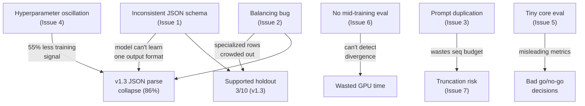

# Nassila L3 Grounding — Training Failure & Regression Deep Diagnosis

> [!CAUTION]
> **Every fine-tuned version (v1 → v1.3) has failed go/no-go.** The stock baseline (untrained Gemma 4 E4B) still outperforms all four QLoRA iterations on the combined metric suite. This report identifies the **root causes** and proposes **actionable solutions** ordered by impact.

---

## 1. Historical Performance Trajectory

| Metric | Stock Baseline | v1.0 | v1.1 | v1.2 | **v1.3** | Target |
|:---|:---|:---|:---|:---|:---|:---|
| Combined expect pass | **86%** | 62% | 66% | 86% | 80% | ≥90% |
| JSON parse (combined+repair) | 100% | 100% | 100% | **100%** | **86%** | ≥95% |
| Quote validity (holdout) | **90.9%** | 0% | 9.1% | **90.9%** | 36.4% | ≥98% |
| False supported (holdout) | 11.8% | 0% | 0% | **0%** | 2.9% | ≤5% |
| Supported holdout (h-001–010) | **10/10** | 0/10 | 1/10 | 9/10 | 3/10 | ≥8/10 |
| Core eval (5 rows) | **4/5** | 3/5 | 3/5 | 2/5 | **5/5** | 5/5 |

> [!IMPORTANT]
> The training process exhibits a **whack-a-mole pattern**: each version fixes one failure mode while introducing a new regression. No version has simultaneously met all five targets. v1.2 was the closest — it met 3/5 targets but collapsed on core eval and quote validity.

---

## 2. Issue Catalog

### Issue 1 — Inconsistent JSON Schema Across Training Labels (CRITICAL)

**Severity:** 🔴 Critical — the single biggest driver of v1.3's JSON parse collapse

**Observation:**
In v1.3's holdout evaluation, 7 of 10 supported rows (h-002, h-004, h-005, h-006, h-007, h-008, h-010) fail with `"Invalid JSON after repair: Expecting ',' delimiter"`. All seven produce the same structural error — a missing `]` bracket closing the `claims` array.

**Root Cause:**
The training dataset contains **two contradictory JSON output schemas** for `supported` claims:

| Row type | Keys present | Key order (last field in claim object) |
|---|---|---|
| Generic supported (`-sup-`, `-supp-`, `-sanad-`, `-chunk-`) ~350 rows | `claim`, `verdict`, `sourceQuotes`, `hasNumericClaim` | Ends with scalar `hasNumericClaim: true/false` |
| New v1.3 rows (`-sanadsem-`, `-multip-`, `-pol-`, `-over-`) ~110 rows | `claim`, `verdict`, `sourceQuotes`, `rationale` | Ends with array `rationale: [...]` |

When the model learns from both patterns, it conflates them during generation. On single-claim supported rows, the model attempts to output `rationale: [...]` as the last key, creating a closing sequence of `]}],` (close rationale → close claim → close claims → comma). The model frequently drops the outer `]`, producing `},` instead of `}],`, which is an unfixable JSON syntax error.

**Why v1.2 didn't have this problem:** All v1.2 supported claims ended with the scalar `hasNumericClaim`, producing the trivial closing sequence `}],`. No array-ending ambiguity existed.

**Evidence in code:**
- [make_supported](file:///e:/Antigravity%20Projects/NassilaT-AG/training/scripts/generate_l3_from_corpus.py#L619-L643): emits `hasNumericClaim`, NO `rationale`
- [make_semantic_sanad_supported](file:///e:/Antigravity%20Projects/NassilaT-AG/training/scripts/generate_l3_from_corpus.py#L808-L836): emits `rationale`, NO `hasNumericClaim`
- [make_multi_claim_partial](file:///e:/Antigravity%20Projects/NassilaT-AG/training/scripts/generate_l3_from_corpus.py#L965-L1005): emits `rationale`, NO `hasNumericClaim`

**Solution:**
1. **Enforce a single, canonical key order** for every claim object in all generator functions. Every claim must emit the same keys in the same order:
   ```json
   {
     "claim": "...",
     "verdict": "...",
     "hasNumericClaim": true,
     "sourceQuotes": ["..."],
     "rationale": ["..."]
   }
   ```
2. **Always terminate claim objects with a scalar.** If `rationale` must be included, ensure it is NOT the last key. Place `hasNumericClaim` last so the closing token sequence is `}]` (simple and learnable).
3. **If a field is absent, emit a default** (`hasNumericClaim: false`, `rationale: []`) rather than omitting the key entirely. This enforces rigid token-pattern learning.

---

### Issue 2 — Catastrophic Balancing Bug: Specialized Rows Crowded Out (HIGH)

**Severity:** 🟠 High — the model barely sees the exact patterns it's being evaluated on

**Observation:**
The [balance_rows](file:///e:/Antigravity%20Projects/NassilaT-AG/training/scripts/generate_l3_from_corpus.py#L1155-L1203) function shuffles all candidate rows per verdict and fills quotas. Generic `-sup-` rows (~350 candidates for "supported") vastly outnumber specialized holdout-shaped rows like `-sanad-` (4 generated), `-supp-` (3 generated), `-chunk-` (2 generated), and `-sanadsem-` (a handful). After shuffling, these rare specialized rows are almost always replaced by generic rows.

**Root Cause:**
```python
# Lines 1170-1181 — no priority distinction
for verdict, quota in quotas.items():
    pool = by_verdict.get(verdict, [])
    rng.shuffle(pool)          # ← All supported rows treated equally
    count = 0
    for r in pool:
        ...
```

The function has a multi-claim priority mechanism (lines 1183-1193) but **no equivalent priority for specialized single-claim rows**. The holdout evaluation tests exactly the patterns that `-sanad-` and `-sanadsem-` rows were designed to teach.

**Solution:**
```python
PRIORITY_SUFFIXES = ("-sanad-", "-sanadsem-", "-supp-", "-chunk-", "-pol-", "-over-", "-multip-", "-multi-")

def balance_rows(rows, target, rng):
    # 1. Always include ALL priority rows first
    priority = [r for r in rows if any(s in r["id"] for s in PRIORITY_SUFFIXES)]
    generic  = [r for r in rows if not any(s in r["id"] for s in PRIORITY_SUFFIXES)]
    
    picked = list(priority)  # Guarantee all specialized rows appear
    seen_ids = {r["id"] for r in picked}
    
    # 2. Fill remaining quota from generic pool
    ...
```

---

### Issue 3 — Training/Eval Prompt Format Divergence (HIGH)

**Severity:** 🟠 High — partially fixed in v1.2+ but still causes silent degradation

**Observation:**
The system prompt is duplicated between the `system` role message and the `user` message content:

- **System message** (line 65 of [train_qlora_gemma4_e4b.py](file:///e:/Antigravity%20Projects/NassilaT-AG/training/scripts/train_qlora_gemma4_e4b.py#L65)): `"You are a strict academic citation grounding assistant."`
- **First line of user prompt** (line 56 of [validate_dataset.py](file:///e:/Antigravity%20Projects/NassilaT-AG/training/scripts/validate_dataset.py#L56)): `"You are a strict academic citation grounding assistant."`

The model sees this instruction **twice** in every training example. During `--chat-template` eval, it also sees it twice. But without `--chat-template`, the system message is absent, causing a distribution shift. This duplication also wastes ~12 tokens per example from the already-tight 1536 sequence length.

**Root Cause:**
[build_grounding_user_prompt](file:///e:/Antigravity%20Projects/NassilaT-AG/training/scripts/validate_dataset.py#L49-L72) bakes the system instruction into the user message body (line 56), AND the chat conversion adds a separate system message (lines 64-65 of the training script).

**Solution:**
1. Remove the system role instruction from the user prompt body in `build_grounding_user_prompt` (delete line 56 of validate_dataset.py)
2. OR remove the system message from chat formatting and keep only the user prompt embedding
3. Ensure eval always matches train (always use `--chat-template` or never use a system message)

---

### Issue 4 — Hyperparameter Oscillation Without Controlled Ablation (MEDIUM)

**Severity:** 🟡 Medium — each version changes multiple variables simultaneously

**Observation:**

| Parameter | v1.0 | v1.1 | v1.2 | v1.3 |
|---|---|---|---|---|
| Train rows | ~350 | 700 | 850 | 850 |
| Epochs | 2 | 2 | **3** | **2** |
| Learning rate | 1e-4 | 2e-4 | **1.5e-4** | **1e-4** |
| Seed | — | 43 | 44 | 45 |
| Dataset changes | Base | +paraphrase | +sanad, +chunk, +anti-weak | +multi, +pol, +over, +sanadsem |

Every version changes **dataset composition + seed + hyperparameters + new row types** simultaneously. This makes it impossible to attribute regressions to any single factor.

**Root Cause:**
No ablation discipline. When v1.2 used 3 epochs at 1.5e-4 and achieved 100% JSON parse, the switch to 2 epochs at 1e-4 in v1.3 reduced total training signal by ~55% (`3 × 1.5e-4 = 4.5e-4` cumulative vs `2 × 1e-4 = 2e-4`). This alone may explain the JSON formatting instability.

**Solution:**
1. **Change one variable at a time.** If testing new data, keep epochs and LR from the best run (v1.2: 3 epochs, 1.5e-4).
2. **Fix the seed** across iterations when possible — only change seed when the dataset composition changes require it.
3. **Add checkpoint-level eval**: Save checkpoints every 50 steps and eval each one. Pick the checkpoint with the best combined metric, not always the last epoch.

---

### Issue 5 — Tiny Core Eval Set Creates Unstable Metrics (MEDIUM)

**Severity:** 🟡 Medium — core eval swings wildly between runs, confounding go/no-go

**Observation:**
The core eval has only **5 rows**. A single row flip changes the pass rate by 20%. Results:

| Version | Core eval pass rate |
|---|---|
| Baseline | 80% (4/5) |
| v1.0 | 60% (3/5) |
| v1.1 | 60% (3/5) |
| v1.2 | **40%** (2/5) |
| v1.3 | **100%** (5/5) |

v1.2's core eval "failure" (40%) masked its otherwise strong holdout performance. v1.3's core eval "success" (100%) masked its catastrophic holdout regression.

**Root Cause:**
Core eval set is too small (n=5) for any statistically meaningful comparison. With 5 rows, the 95% confidence interval for a 60% pass rate spans from 23% to 88%.

**Solution:**
1. **Expand core eval to ≥20 rows** covering all verdict categories
2. **Use only the holdout set** (n=45) for go/no-go decisions — it's large enough for category-level analysis
3. **Report confidence intervals**, not point estimates, for sets under n=30

---

### Issue 6 — No Eval-During-Training Loop (MEDIUM)

**Severity:** 🟡 Medium — wasteful and risky cloud GPU usage

**Observation:**
Training runs on Vast AI without mid-training evaluation. The full pipeline is: train all epochs → merge → convert to GGUF → serve → eval. If training diverges at epoch 1.5, the remaining compute, merge, and GGUF conversion are wasted.

**Root Cause:**
The `TrainingArguments` in [train_qlora_gemma4_e4b.py](file:///e:/Antigravity%20Projects/NassilaT-AG/training/scripts/train_qlora_gemma4_e4b.py#L130-L143) has `save_strategy="no"` and no evaluation dataset:

```python
training_args = TrainingArguments(
    ...
    save_strategy="no",       # ← No checkpoints saved
    report_to="none",         # ← No training curves visible
    ...
)
```

**Solution:**
```python
training_args = TrainingArguments(
    ...
    save_strategy="steps",
    save_steps=50,
    save_total_limit=3,
    eval_strategy="steps",     # Add eval dataset
    eval_steps=50,
    load_best_model_at_end=True,
    metric_for_best_model="eval_loss",
    report_to="tensorboard",   # Visualize training curves
    ...
)
```

---

### Issue 7 — Sequence Length Truncation Risk (LOW-MEDIUM)

**Severity:** 🟡 Low-Medium — may silently truncate training targets

**Observation:**
`MAX_SEQ_LENGTH = 1536` in the training script. The user prompt includes:
- System prompt (~12 tokens)
- Multi-line grounding instructions (~150 tokens)
- Passage text (variable)
- `SOURCE_EXCERPT` — up to 1800 chars (`EXCERPT_CHUNK_MAX`) ≈ ~450 tokens
- Assistant JSON output (variable)

For papers with long abstracts (1500+ chars), the total sequence can exceed 1536 tokens. When truncated, the assistant response JSON is cut off, and the model learns to generate incomplete JSON.

**Evidence:**
`EXCERPT_CHUNK_MAX = 1800` chars in [generate_l3_from_corpus.py](file:///e:/Antigravity%20Projects/NassilaT-AG/training/scripts/generate_l3_from_corpus.py#L50), while `MAX_SEQ_LENGTH = 1536` tokens. A character-to-token ratio of ~0.75 means 1800 chars ≈ ~600 tokens for the excerpt alone, leaving ≤936 tokens for the rest of the prompt AND the output.

**Solution:**
1. Add a pre-training validation step that tokenizes each chat example and reports any exceeding `MAX_SEQ_LENGTH`
2. Either increase `MAX_SEQ_LENGTH` to 2048-4096 (A6000 can handle it with QLoRA) or reduce `EXCERPT_CHUNK_MAX` to 1200 chars
3. Filter out or truncate training examples that exceed the limit

---

### Issue 8 — Supported-Paraphrase Bias Inversion (v1.0/v1.1 specific, now partially fixed)

**Severity:** 🟢 Low (addressed in v1.2 but risk of re-emergence)

**Observation:**
v1.0 and v1.1 systematically called `weak` on paraphrased supported claims (0/10 and 1/10 respectively). The model learned to treat any wording difference as "hedging."

**Root Cause:**
- v1.0's training data was heavily skewed toward `weak` verdict examples that stripped hedges
- The model generalized: "different wording = weak," even when numbers and facts aligned perfectly
- h-001 produced correct `sourceQuotes` with wrong verdict — proof the model could extract but not classify

**Status:** Partially fixed in v1.2 by adding anti-false-weak pairs and `-sanad-` rows. But the v1.3 balancing bug (Issue 2) likely diluted these rows back out.

**Solution:** Already addressed in concept; ensure Issue 2 fix guarantees these rows survive balancing.

---

## 3. Root Cause Dependency Graph



---

## 4. Prioritized Fix Plan

| Priority | Issue | Fix | Expected Impact |
|:---|:---|:---|:---|
| **P0** | #1 Inconsistent JSON schema | Uniform key order + always end with scalar | Restore 100% JSON parse |
| **P0** | #2 Balancing bug | Priority-include specialized rows | Fix supported holdout |
| **P1** | #4 Hyperparameter stability | Return to 3 epochs / 1.5e-4; change one var at a time | Prevent regression |
| **P1** | #6 Mid-training eval | Add checkpoints + eval_dataset | Detect divergence early |
| **P2** | #3 Prompt duplication | Deduplicate system instruction | Gain ~12 tokens/example |
| **P2** | #5 Expand core eval | ≥20 rows balanced across categories | Stable go/no-go |
| **P2** | #7 Seq length validation | Pre-training length check + raise limit | Prevent truncation |

---

## 5. Recommended v1.4 Configuration

```
Dataset:      850 rows (same), seed 45, uniform JSON schema
Schema:       Every claim: {claim, verdict, hasNumericClaim, sourceQuotes, rationale}
              hasNumericClaim ALWAYS last key (scalar terminator)
Balancing:    Priority-include all -sanad-, -sanadsem-, -supp-, -chunk-, -pol-, -over- rows
Epochs:       3  (match v1.2)
LR:           1.5e-4  (match v1.2)
Seq length:   2048  (or validate all examples fit 1536)
Checkpoints:  Every 50 steps, keep best 3
Eval:         Eval loss every 50 steps on held-out chat JSONL
```

> [!TIP]
> If this configuration achieves 100% JSON parse + ≥9/10 supported holdout (matching v1.2), **then** introduce the new row types one batch at a time in v1.5+, each time verifying no metric regresses.

---

## 6. Insights from the Cursor Conversation Log (12,836 lines)

Reading your full [cursor_phase_2_comprehensive_plan.md](file:///e:/Antigravity%20Projects/NassilaT-AG/cursor_phase_2_comprehensive_plan.md) reveals several additional factors contributing to the dwindling process:

### 6.1 — Repeated Tooling Failures Consumed GPU Time

The v1.0 training on Vast was successful (100/100 steps in ~10 min), but the GGUF export saga consumed the entire rest of the session. The `export_gguf.py` script created an empty output directory before calling `save_pretrained_gguf`, which Unsloth expected to contain `config.json`. Cursor gave **three consecutive incorrect fixes** before discovering the real issue — the merge step never completed (112 MB output vs the expected 8-12 GB). This pattern repeated across versions with llama.cpp build failures on floating `main` (the `asset_60_data` bug).

**Impact:** Each Vast session incurred significant debugging overhead, reducing time available for iterative experimentation. The eventual fix — pinning to `b9608` and using `merge_adapter_gemma4.py` + manual llama.cpp conversion — was robust but arrived late.

### 6.2 — The h-001 "Smoking Gun" Was Never Fully Exploited

In the v1.0 evaluation, h-001's raw output was:
```json
{"claims": [{"claim": "The new test had 95% sensitivity.", "verdict": "weak",
  "sourceQuotes": ["Diagnostic sensitivity was 95% (95% CI 92-97)..."],
  "rationale": ["Abstract uses more hedged wording than the passage"]}],
  "overallVerdict": "weak"}
```

This is a **perfect diagnostic example**: correct quote extraction, correct number matching, but wrong verdict. The model learned `"different wording = weak"` from the training data's hedge-stripping pattern. Cursor correctly diagnosed this as "verdict calibration, not JSON or quote extraction" — but subsequent fixes (v1.1, v1.2) only partially addressed it through data augmentation, never directly through loss weighting or explicit contrastive examples.

### 6.3 — No Systematic Failure Mode Tracking

Across four iterations, the same holdout rows (h-001–h-010, h-028, h-043, h-045) fail repeatedly. But there is no structured log tracking *why* each row fails per version, what the raw output was, and whether the failure mode changed. The reports only record pass/fail per row. A failure mode taxonomy ("wrong verdict", "missing bracket", "truncated output", "hallucinated quote") would reveal whether fixes are actually targeting the right symptoms.

---

### Issue 9 — Process Overhead: High Cost of Each Iteration (LOW)

**Severity:** 🟢 Low (not a model issue, but accelerates burnout)

**Observation:** Each training iteration requires:
1. Renting a Vast GPU instance (~$1-3/hr)
2. Setting up environment (clone, venv, llama.cpp build)
3. Training (~15-20 min)
4. Merge (~15-30 min)
5. GGUF conversion (~5 min)
6. Eval (~15 min)
7. Debugging any tooling failures (0-120 min)
8. Downloading reports, uploading adapter
9. Destroying instance

Total wall-clock per iteration: **2-4 hours including setup/debugging**. With four iterations over multiple days, this process is exhausting and incentivizes making many changes per iteration ("since we're paying for the GPU, let's add everything") — which directly causes Issue 4 (multi-variable changes).

**Solution:**
1. Create a **single-command training script** that does train → merge → GGUF → eval in sequence
2. **Pre-bake the environment** into a Vast template or Docker image
3. Consider a **shorter eval loop** during training (eval loss on held-out chat JSONL) to catch problems before the full GGUF pipeline

---

## 7. Summary

The training process is dwindling because of a **compounding cycle**: each iteration adds new data patterns while inadvertently breaking formatting stability. The three most damaging issues are:

1. **Contradictory JSON schemas** in training labels → model can't consistently close nested brackets
2. **Random balancing** that discards the exact specialized rows designed to fix eval failures
3. **Changing multiple variables per iteration** with no isolation → impossible to diagnose what helps and what hurts

The stock baseline remains competitive because it was never taught conflicting patterns. The path forward requires **schematic uniformity** in the dataset, **deterministic inclusion** of critical training rows, and **single-variable iteration** discipline.

The Cursor conversation log also reveals a significant **process tax**: tooling issues (GGUF export bugs, llama.cpp build failures) consumed as much time as actual training, creating pressure to bundle too many changes per iteration. Streamlining the train→eval pipeline would both reduce cost and enable the single-variable iteration discipline that's currently missing.
