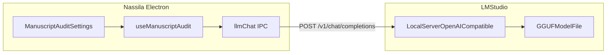

# LM Studio Integration with Nassila

How to run your **baseline or fine-tuned** Gemma model in LM Studio and connect it to Nassila’s existing OpenAI-compatible LLM path.

**Ouroboros:** See [Nassila `docs/OUROBOROS_CONTEXT.md`](https://github.com/jamalesam93/Nassila/blob/main/docs/OUROBOROS_CONTEXT.md). Worker **Sanad** = `l3_grounding`. See [`nassila-agent-tasks.ts`](https://github.com/jamalesam93/Nassila/blob/main/src/shared/nassila-agent-tasks.ts).

| Artifact | Tasks (v1 / future) |
|----------|---------------------|
| `nassila-sanad-e4b` | `l3_grounding` only |
| `nassila-sanad-12b` | `l3_grounding` (quality tier) |
| `nassila-agent-e12b-v1` | All facets (planned) |

---

## Architecture



App code reference:

- IPC: [`src/main/ipc-llm.ts`](../src/main/ipc-llm.ts)
- Presets: [`src/renderer/components/ManuscriptAudit/llm-presets.ts`](../src/renderer/components/ManuscriptAudit/llm-presets.ts)
- Grounding call: [`src/renderer/hooks/use-manuscript-audit.ts`](../src/renderer/hooks/use-manuscript-audit.ts)

---

## Step 1 — Load model in LM Studio

1. Import or select your GGUF:
   - **Baseline:** Gemma 4 E4B Instruct Q6_K (already downloaded)
   - **Tuned:** `nassila-grounding-e4b-q6_k-v1.gguf` (after export from training)
2. If load fails with “unknown architecture gemma4”, **update LM Studio’s llama.cpp runtime** (2.10.1+ recommended for Gemma 4).

---

## Step 2 — Start local server

1. Open **Local Server** in LM Studio.
2. Select the loaded model.
3. Start server — note:
   - **Port** (often `1234`)
   - **Model id** string used in API requests (copy from UI)

Example endpoints:

- OpenAI base: `http://localhost:1234/v1`
- Nassila app base URL: `http://localhost:1234` (app appends `/v1/chat/completions`)

---

## Step 3 — Laptop smoke test (ship GGUF acceptance)

After downloading `nassila-sanad-e4b-q6_k.gguf` or `nassila-sanad-12b-q6_k.gguf`, run the 4-row acceptance wrapper:

```powershell
cd training
.\scripts\run_laptop_smoke.ps1 -Model "PASTE_LM_STUDIO_MODEL_ID" -Arm e4b
.\scripts\run_laptop_smoke.ps1 -Model "PASTE_LM_STUDIO_MODEL_ID" -Arm 12b
```

Full runbook: [`LAPTOP_SMOKE_TEST.md`](./LAPTOP_SMOKE_TEST.md). Record results in `outputs/LAPTOP_SMOKE_SIGNOFF.md`.

### Quick single-row test

```powershell
cd training
python scripts/lmstudio_smoke_test.py `
  --base-url http://localhost:1234 `
  --model "google/gemma-4-e4b" `
  --task l3_grounding `
  --chat-template --retry 1 --repair
```

Replace `--model` with the exact identifier LM Studio shows.

Expected: HTTP 200, parseable Sanad JSON for `l3_grounding` task.

---

## Step 4 — Configure Nassila

Manuscript audit UI is retired but settings code remains in [`AuditView.tsx`](../src/renderer/components/ManuscriptAudit/AuditView.tsx). When re-enabled or for dev builds:

| Setting | Value |
|---------|--------|
| Preset | **vLLM / llama.cpp / LM Studio (local)** |
| Base URL | `http://localhost:1234` |
| Model | Exact LM Studio model id |
| API key | Any short placeholder (e.g. `lm-studio`) — localhost allows short keys |
| LLM enabled | On |

Prefs persist via [`src/shared/manuscript-audit-prefs.ts`](../src/shared/manuscript-audit-prefs.ts).

### Default preset tweak (future app change)

Consider adding a dedicated preset:

```typescript
{
  id: 'lmstudio',
  label: 'LM Studio (local)',
  baseUrl: 'http://localhost:1234',
  defaultModel: 'google/gemma-4-e4b',
  modelHints: ['google/gemma-4-e4b', 'nassila-grounding-e4b-v1'],
  notes: 'Start LM Studio local server first. Base URL without /v1 suffix.'
}
```

(Not required for training folder; documented for when you wire the app.)

---

## Step 5 — Request shape (what the app sends)

From [`ipc-llm.ts`](../src/main/ipc-llm.ts):

```json
{
  "model": "your-model-id",
  "messages": [
    { "role": "user", "content": "<buildGroundingUserPrompt output>" }
  ],
  "temperature": 0.2
}
```

Headers:

```
Authorization: Bearer <stored key>
Content-Type: application/json
```

For local LM Studio, authorization is often ignored but Nassila still requires a stored key (encrypted via Electron `safeStorage`).

---

## Step 6 — Manual curl test

```bash
curl http://localhost:1234/v1/chat/completions ^
  -H "Content-Type: application/json" ^
  -H "Authorization: Bearer lm-studio" ^
  -d "{\"model\":\"google/gemma-4-e4b\",\"messages\":[{\"role\":\"user\",\"content\":\"Reply with the single word: ok\"}],\"temperature\":0.2}"
```

---

## Fine-tuned model workflow

1. Train QLoRA → export GGUF Q6_K (see [PHASE2_9_AB_PILOT_WALKTHROUGH.md](./PHASE2_9_AB_PILOT_WALKTHROUGH.md))
2. Import new GGUF into LM Studio
3. Optionally **unload** baseline model to save VRAM
4. Start server with **tuned** model selected
5. Update Nassila model name to `nassila-grounding-e4b-v1` (or your filename)
6. Re-run eval ([EVALUATION_GUIDE.md](./EVALUATION_GUIDE.md))

Keep baseline GGUF for A/B comparison.

---

## Performance tips

- **Context length:** L3 prompts are ~4–6k tokens; avoid loading max 128k context if LM Studio allows limiting — saves RAM.
- **GPU offload:** Enable maximum GPU layers in LM Studio if available.
- **Batch audits:** Manuscript audit loops citation sites sequentially; slow local models mean long runs — set user expectations.

---

## Security and privacy

- Traffic stays on `localhost` — good for unpublished manuscripts.
- Do not expose LM Studio server to LAN without authentication.
- API keys in Nassila are stored encrypted; local placeholder is fine.

---

## Troubleshooting

| Symptom | Fix |
|---------|-----|
| Connection refused | Start LM Studio server; check port |
| 404 on chat | Use base URL without duplicate `/v1` in app setting |
| Empty model response | Update llama.cpp runtime; try Q4_K_M export |
| JSON always fenced | Retrain; or strip fences in parser (app already tries `{...}` slice) |
| Encryption blocked | Windows safeStorage issue — LLM disabled in app until fixed |

---

## Related

- [`LAPTOP_SMOKE_TEST.md`](./LAPTOP_SMOKE_TEST.md) — ship GGUF acceptance (4-row smoke)
- [PHASE2_9_AB_PILOT_WALKTHROUGH.md](./PHASE2_9_AB_PILOT_WALKTHROUGH.md) — export GGUF after training
- [scripts/lmstudio_smoke_test.py](./scripts/lmstudio_smoke_test.py) — automated smoke test
